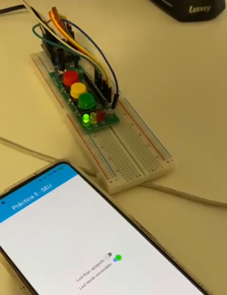
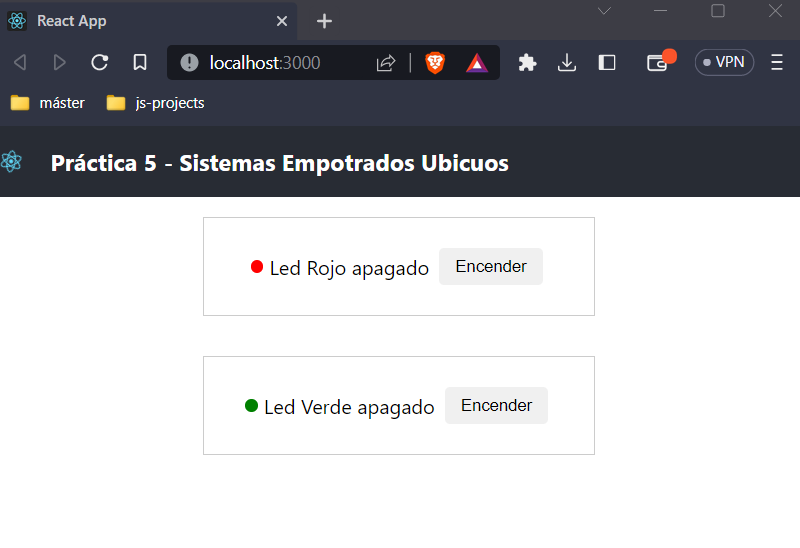

# EmbeddedSystems Lab5

This repo contains the solution to the fifth laboratory of the embedded systems subject of the master's degree in computer science at the University of Zaragoza. 

## Problem
We wanted to monitor and control the state of a simple IoT device from mobile and web applications. The state can also be modified from the device itself.
| Device | 
:------:

## Solution 
Create a server to which both the device and the different applications can connect, so that the information can be centralized.

| Web app |
:------:
 |
Mobile App |
 |
